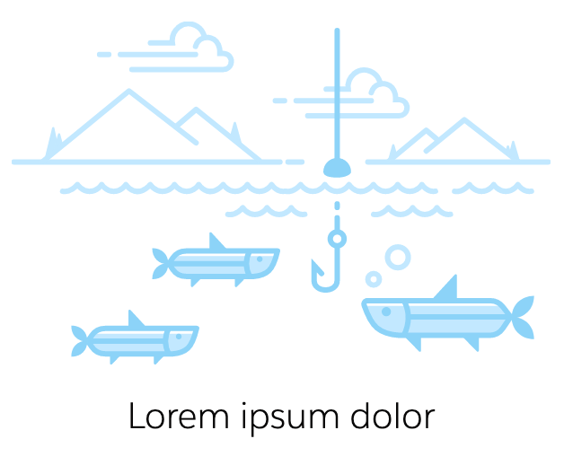
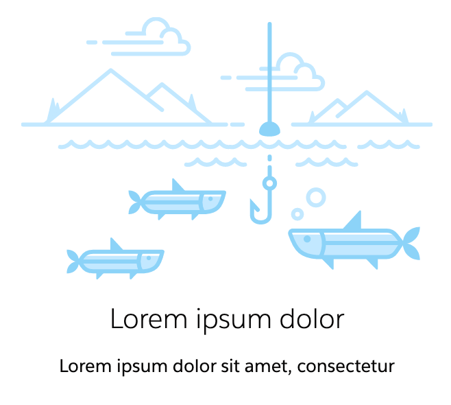
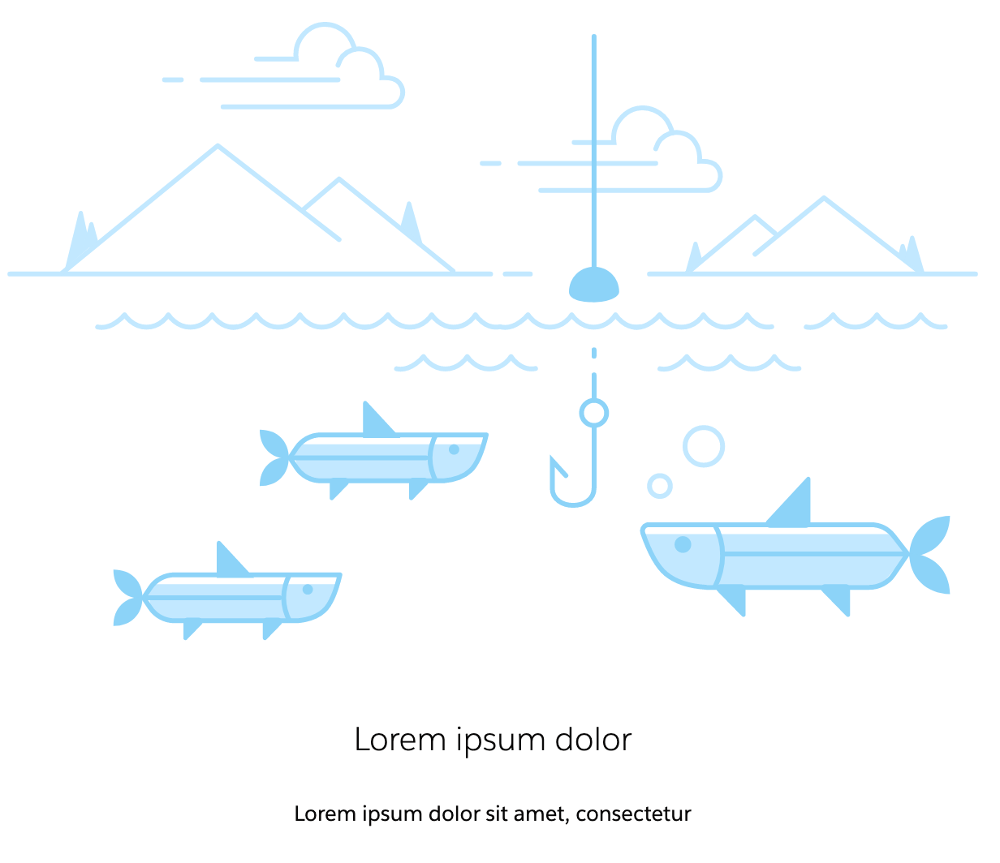
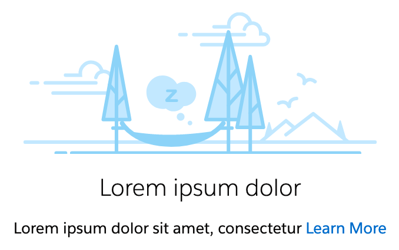
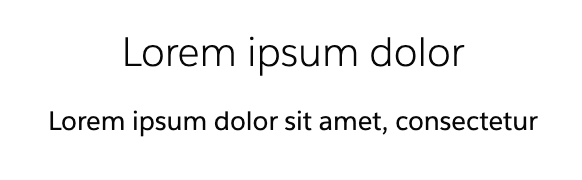

# SLDS Illustration Lightning Web Component

The [SLDS Illustration component blueprint](https://www.lightningdesignsystem.com/components/illustration/) as a Lightning Web Component. Also usable in Lightning App Builder.

</img>

# Installation

Deploy the `illustration` and `illustration-image` components into your org manually or click the button below!

<a href="https://githubsfdeploy.herokuapp.com?owner=kacrouse&amp;repo=lwc-illustration">
  
</a>

# Usage

- The `illustration` component displays an Illustration that adheres to the blueprint laid out in SLDS. It depends on `illustration-image`.
- The `illustration-image` component displays only an Illustration image with no text.

_Note that `illustration` has size constraints placed on it by SLDS while `illustration-image` will fill the width of its container._

## Image Options

Images are specified via an identifier in the format `category:description`, where `category` and `description` are the [snake_case](https://en.wikipedia.org/wiki/Snake_case) form of the categories and image labels given on the [SLDS Illustration page](https://www.lightningdesignsystem.com/components/illustration/). For an explicit list of all identifiers, see [illustrationImage/images/index.js](./force-app/main/default/lwc/illustrationImage/images/index.js#L24)

See the [SLDS Illustration page](https://www.lightningdesignsystem.com/components/illustration/) for what each identifier renders as well as when to use each image.

## Examples

### [Base](https://www.lightningdesignsystem.com/components/illustration/#Base)

```html
<c-illustration
  heading="Lorem ipsum dolor"
  image-name="custom:fishing_deals"
></c-illustration>
```

</img>

### [With Message Body](https://www.lightningdesignsystem.com/components/illustration/#With-Message-Body)

```html
<c-illustration
  heading="Lorem ipsum dolor"
  message-body="Lorem ipsum dolor sit amet, consectetur"
  image-name="custom:fishing_deals"
></c-illustration>
```

</img>

### [Large](https://www.lightningdesignsystem.com/components/illustration/#Large-Illustrations)

```html
<c-illustration
  heading="Lorem ipsum dolor"
  message-body="Lorem ipsum dolor sit amet, consectetur"
  image-name="custom:fishing_deals"
  image-size="large"
></c-illustration>
```

</img>

### [With Call to Action](https://www.lightningdesignsystem.com/components/illustration/#With-Call-to-Action)

```html
<c-illustration heading="Lorem ipsum dolor" image-name="custom:no_task">
  <p slot="messageBody" class="slds-text-body_regular">
    Lorem ipsum dolor sit amet, consectetur&nbsp;
    <a href="#">Learn More</a>
  </p>
</c-illustration>
```

</img>

### [Text Only](https://www.lightningdesignsystem.com/components/illustration/#Text-Only)

```html
<c-illustration
  heading="Lorem ipsum dolor"
  message-body="Lorem ipsum dolor sit amet, consectetur"
  text-only
></c-illustration>
```

</img>
